   

# Arrow Board

## How it works

This project displays various flashing and animated arrow signs used for controlling traffic.

There are sixteen patterns selectable with inputs 0-3. Input 4 enables flashing and input 5 enables an animated sequence.

| Pattern | Steady/Flashing     | Animated Sequence                                           |
| ------- | ------------------- | ----------------------------------------------------------- |
| 0       | 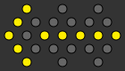 | 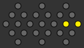 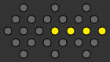  |
| 1       | 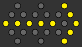 | 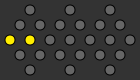 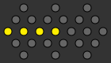  |
| 2       |  |  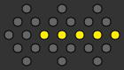  |
| 3       |  |  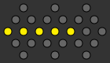  |
| 4       |  | 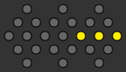   |
| 5       |  | 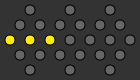   |
| 6       |  | 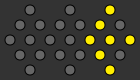 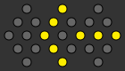  |
| 7       |  | 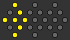 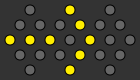  |
| 8       | 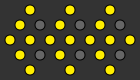 |  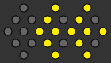  |
| 9       | 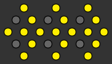 |  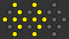  |
| 10      | 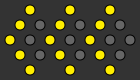 | 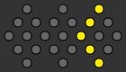 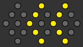  |
| 11      | 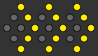 | 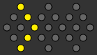 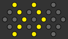  |
| 12      | 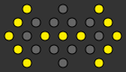 |  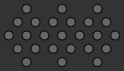                     |
| 13      | 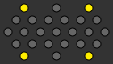 |                       |
| 14      | 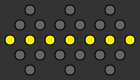 |                       |
| 15      | 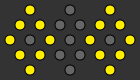 | 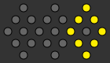 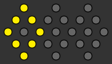                     |

## How to test

Set `ui_in[7]` low and `ui_in[6]` low. All outputs should be low.

Set `ui_in[7]` high and `ui_in[6]` low. All outputs should be high.

Set `ui_in[3:0]` to one of the sixteen patterns. Set `ui_in[4]` low and `ui_in[5]` low. Set `ui_in[6]` high. Pulse `clk` at a desired rate. Outputs should reflect a steady pattern.

Set `ui_in[3:0]` to one of the sixteen patterns. Set `ui_in[4]` high and `ui_in[5]` low. Set `ui_in[6]` high. Pulse `clk` at a desired rate. Outputs should alternate between a steady pattern and a blank pattern.

Set `ui_in[3:0]` to one of the sixteen patterns. Set `ui_in[4]` low and `ui_in[5]` high. Set `ui_in[6]` high. Pulse `clk` at a desired rate. Outputs should reflect a sequential pattern with a repeated last frame.

Set `ui_in[3:0]` to one of the sixteen patterns. Set `ui_in[4]` high and `ui_in[5]` high. Set `ui_in[6]` high. Pulse `clk` at a desired rate. Outputs should reflect a sequential pattern with a blank last frame.

Special cases: The animated versions of patterns 12, 13, and 14 behave the same as the flashing versions and are unaffected by input 4. The animated version of pattern 15 always alternates between the same two frames without repeated or blank frames.

## External hardware

An array of 25 LEDs in the following configuration:

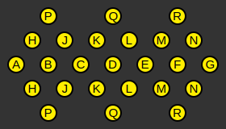

| Lamp | Output       | Lamp | Output       |
| ---- | ------------ | ---- | ------------ |
| A    | `uo_out[0]`  | J    | `uio_out[0]` |
| B    | `uo_out[1]`  | K    | `uio_out[1]` |
| C    | `uo_out[2]`  | L    | `uio_out[2]` |
| D    | `uo_out[3]`  | M    | `uio_out[3]` |
| E    | `uo_out[4]`  | N    | `uio_out[4]` |
| F    | `uo_out[5]`  | P    | `uio_out[5]` |
| G    | `uo_out[6]`  | Q    | `uio_out[6]` |
| H    | `uo_out[7]`  | R    | `uio_out[7]` |

Set `ui_in[7]` high if a high level lights the LED or low if a low level lights the LED.

## What is Tiny Tapeout?

Tiny Tapeout is an educational project that aims to make it easier and cheaper than ever to get your digital and analog designs manufactured on a real chip.

To learn more and get started, visit https://tinytapeout.com.

## Resources

- [FAQ](https://tinytapeout.com/faq/)
- [Digital design lessons](https://tinytapeout.com/digital_design/)
- [Learn how semiconductors work](https://tinytapeout.com/siliwiz/)
- [Join the community](https://tinytapeout.com/discord)
- [Build your design locally](https://www.tinytapeout.com/guides/local-hardening/)
